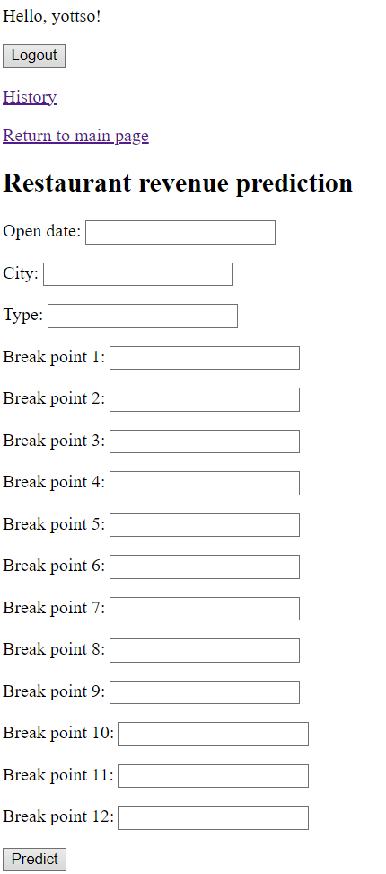

## Restaurant Revenue Prediction App  🍔📈

<p align="center">
  
</p>

### Project Description

This project is a web application designed to predict restaurant revenue based on user-provided information. The app utilizes a modern microservice architecture, ensuring scalability and flexibility.

### Key Features ✨

* **Accurate Predictions:** Leverages the power of XGBoost, a robust machine learning model trained on an extensive dataset, to deliver accurate revenue forecasts.
* **Microservice Architecture:** The application is divided into two services - a prediction model (XGBoost) and a Django application for presentation - allowing for flexibility and scalability.
* **Asynchronous Data Processing:** Kafka, a reliable message broker, ensures seamless asynchronous communication between services.
* **High Performance:** Redis is employed for data caching, boosting application speed and responsiveness.
* **Easy Deployment:** Docker Compose simplifies the application launch and deployment, enabling effortless setup and management.

### Functionality 🚀

* **User Registration and Login:** Secure user authentication to safeguard sensitive data.
* **Intuitive Prediction Form:**  User-friendly form for inputting restaurant information, including location, cuisine type, and other relevant parameters.
* **Visual Prediction Display:**  Clear presentation of the predicted revenue using charts and graphs.
* **Prediction History Storage:** Option to store historical requests and predictions for future analysis.

### Technologies Used 💻

* **Backend:** Python 3.12, Django, XGBoost 
* **Caching:** Redis
* **Message Queue:** Kafka
* **Containerization:** Docker, Docker Compose

### Key Code Snippets 🔍

```python
# Example code for prediction using XGBoost
import xgboost as xgb

# Load the model
model = xgb.Booster()
model.load_model('restaurant_model.xgb')

# Prepare data for prediction
input_data = [...]

# Get the prediction
prediction = model.predict(input_data)
```

```python
# Example Django code for handling prediction request
from django.shortcuts import render
from .forms import PredictionForm

def predict_revenue(request):
    if request.method == 'POST':
        form = PredictionForm(request.POST)
        if form.is_valid():
            # Process data from the form
            # ...
            # Send data to the Kafka queue for processing by the model
            # ...
            # Pass the prediction to the template
            return render(request, 'prediction_result.html', {'prediction': prediction})
    else:
        form = PredictionForm()
    return render(request, 'prediction_form.html', {'form': form})
```

### Installation and Launch 🛠️

1. Install Docker and Docker Compose.
2. Clone the project repository: `git clone https://github.com/YOTTSO/softarex-project.git`
3. Navigate to the project directory: `cd .\softarex-project\restaurant_app`
4. Start Docker Compose: `docker-compose up -d --build`

### Usage 🖱️

1. Open the application in your browser: `http://localhost:8000/prediction_app/predict_revenue`.
2. Register or log in to an existing account.
3. Fill out the form with the restaurant information.
4. Click the "Predict" button to see the revenue prediction.

### Контакты

[Illya Stavsky - YOTTSO](https://t.me/yottso) 
